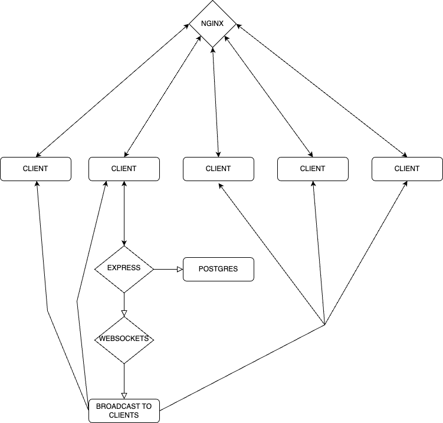

# Digging WebSockets
> Hey team ! What's up ? Et oui, a l'approche de la fin de formation on va corser un petit peu les choses. Pour cette activité transverse, le contenu va vous être donner en anglais. L'objectif est de bien sûr de se préparer pour le questionnaire professionnel. Bon courage !

Hi everybody! Today we're going to explore a super cool feature for instant communication between backend and frontends: **WebSockets**.

You might be thinking, "That's only for chat applications, and I don't need to code a chat...", but you'll see the power of WebSockets during this workshop. First of all, read some documentation about this protocol:

* [Wikipedia](https://en.wikipedia.org/wiki/WebSocket)
* [MDN: Writing WebSocket client app](https://developer.mozilla.org/en-US/docs/Web/API/WebSockets_API/Writing_WebSocket_client_applications)
* [MDN: Writing WebSocket server](https://developer.mozilla.org/en-US/docs/Web/API/WebSockets_API/Writing_WebSocket_servers)

## Goals

This workshop has multiple objectives. All the code (backend and frontend) will be written in Vanilla JavaScript - no framework, no ORM! Don't worry about style; it's only a Proof Of Concept 😎.

The app built is an eBay-like auction system. Your job is to achieve these 3 steps:

1. Run the app and play with the bidding system. It's a containerized app using Docker and Docker Compose. You can see in `docker-compose.yml` four services: socketserver, backend, database, and webserver (frontend). Take care of the `.env.example` files! You need to open multiple windows to simulate multiple users 😉.
2. Explore and review the code. It's pure Vanilla JavaScript with as few dependencies as possible, like in "the good old days" 🎶. It's a great way to understand how each part works. Don't forget to inspect `SQL/create_tables.sql`; you will discover some rules and triggers 😱.
3. Finally, add a feature to the frontend. We want to show a log view to see the contents of the `auction_logs` table. Obviously, use WebSockets to watch each change 🤓.

## Tips

### Run the app

You only need to run `docker compose up` and go to `localhost:8080` to see the frontend.

### Understand architecture

### Add HTML page

You only need to create HTML files in the `docker_config/nginx/views` folder. There is no router, so all links will be like `<a href="file.html">`.

### Add CSS / JS

Add some files into `docker_config/nginx/assets/*`. Warning, URLs are absolute, like `rel="/assets/js/file.css"`.

### How to start
1- configure .env
2- Docker compose up 
3- localhost:8100 for Adminer
4- localhost: 8084 for frontend
5- localhost: 3000 for data view

# Mon Projet : 

Voici quelques captures d'écran du projet :

